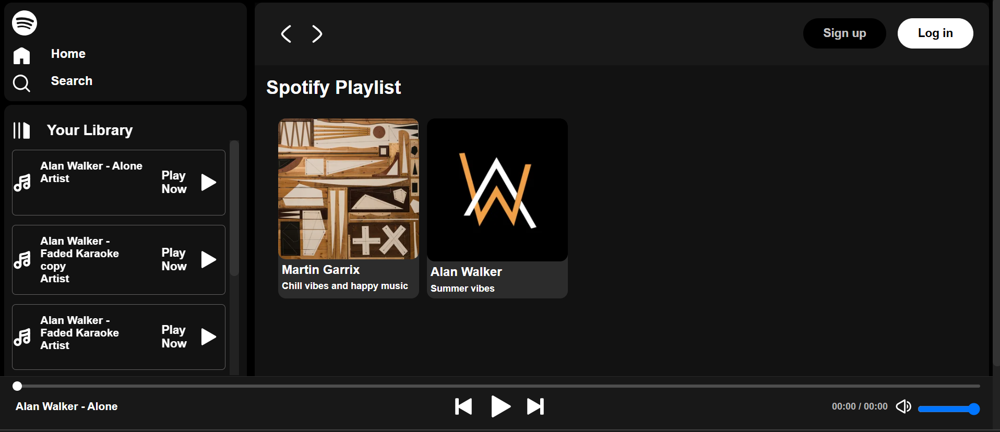
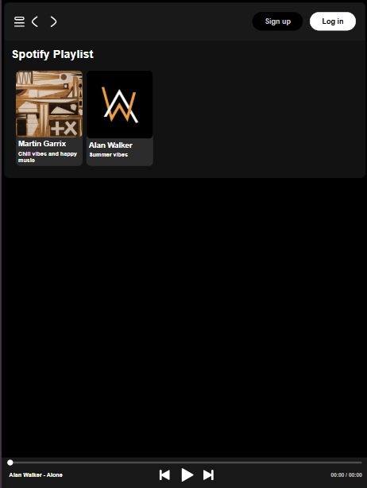
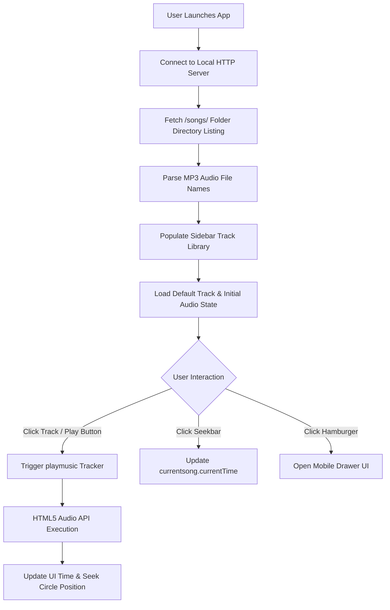

# 🎵 Spotify Web Player Clone

[](https://developer.mozilla.org/en-US/docs/Web/HTML)
[](https://developer.mozilla.org/en-US/docs/Web/CSS)
[](https://developer.mozilla.org/en-US/docs/Web/JavaScript)
[](LICENSE)
[](https://github.com/visheshio/Spotifyclone/pulls)

A modern, lightweight, and responsive **Spotify Web Player Clone** engineered using pure Vanilla HTML5, CSS3, and JavaScript (ES6+). This project replicates the iconic dark-themed interface of Spotify, featuring real-time audio playback, interactive seek controls, volume management, dynamic album track loading, and full mobile responsiveness without any external frameworks or libraries.

---

## 📸 Screenshots & Preview


| **Desktop Web Player UI** | **Mobile Navigation Drawer** |
| :---: | :---: |
|  |  |

---

## ✨ Key Features

- **🎧 Dynamic Album & Song Loading**: Fetches track listings directly from server directory endpoints asynchronously.
- **🎛️ Comprehensive Playback Controls**: Play, pause, skip forward (`Next Track`), and skip backward (`Previous Track`) with instant state synchronization.
- **⏱️ Interactive Seek Bar**: Dynamic progress tracking with real-time timestamp updates (`MM:SS`) and click-to-seek audio position adjustment.
- **🔊 Volume Controls**: Flexible volume range slider allowing smooth real-time amplitude adjustments.
- **📁 Sidebar Music Library**: Displays active playlist songs with track info and quick click-to-play functionality.
- **📱 Fully Responsive UI**: Mobile-optimized design featuring a slide-out hamburger navigation drawer and responsive breakpoints.
- **🎨 Authentic Spotify Aesthetic**: High-fidelity dark mode interface complete with custom webkit scrollbars, hover play buttons, cards, and typography.
- **⚡ Zero Dependencies**: Built strictly using standard web web technologies (Vanilla HTML/CSS/JS) for ultra-fast load times.

---

## 🛠️ Tech Stack & Architecture

- **Frontend Core**: Vanilla HTML5, CSS3 (Custom Properties, Flexbox, Media Queries)
- **Scripting & Audio Engine**: Modern JavaScript (ES6+ Async/Await, DOM API, HTML5 `Audio` Object)
- **Styling Architecture**: 
  - `style.css`: Primary application layout, components, and media query breakpoints.
  - `utility.css`: Modular utility classes (`flex`, `items-center`, `rounded`, custom scrollbars).
- **Icons & Assets**: Custom SVG UI icons & MP3 Audio streams.

---

## 📁 Project Directory Structure

```text
Spotifyclone/
├── 📄 index.html        # Main HTML entry point (Sidebar, Main Grid, Playbar)
├── 🎨 style.css         # Primary stylesheet (Layouts, themes, animations, responsive design)
├── 🛠️ utility.css       # Reusable CSS utility classes & custom scrollbars
├── 📜 script.js        # Core JavaScript application logic & audio control engine
├── 🖼️ img/              # SVG icons & album art assets
│   ├── close.svg        # Drawer close icon
│   ├── hamburger.svg    # Mobile navigation toggle icon
│   ├── happymood.jfif   # Happy Moods playlist cover art
│   ├── musicmood.jfif   # Music Moods playlist cover art
│   ├── home.svg         # Sidebar home icon
│   ├── search.svg       # Sidebar search icon
│   ├── playlist.svg     # Your Library icon
│   ├── logo.svg         # Spotify brand logo
│   ├── play.svg         # Green hover play button
│   ├── playsong.svg     # Playbar play icon
│   ├── pause.svg        # Playbar pause icon
│   ├── previous.svg     # Playbar previous track icon
│   ├── nextsong.svg     # Playbar next track icon
│   └── volume.svg       # Playbar volume icon
└── 🎵 songs/            # Audio library organized by album folders
    ├── Alanwalker/      # Alan Walker album tracks (.mp3)
    └── martingarrix/    # Martin Garrix album tracks (.mp3)
```

---

## ⚙️ How It Works

### Application Data Flow



### Why an HTTP Server is Required
Because the application dynamically scans local server directory listings via the JavaScript `Fetch API` (`fetch('/songs/')`) to index available MP3 files, browsing directly via `file://` protocol in the browser will block directory indexing due to browser CORS and security policies. Serving the files over a lightweight HTTP server allows `script.js` to parse directory contents cleanly.

---

## 🚀 Getting Started

### 📋 Prerequisites

Ensure you have a modern web browser installed:
- Google Chrome, Mozilla Firefox, Microsoft Edge, or Apple Safari.
- A local HTTP server runner (e.g., VS Code **Live Server**, Python 3, or Node.js `http-server`).

### 📦 Installation

1. **Clone the Repository**:
   ```bash
   git clone https://github.com/visheshio/Spotifyclone.git
   ```

2. **Navigate into the Project Directory**:
   ```bash
   cd Spotifyclone
   ```

### 🏃 Running the Application

Choose **one** of the following methods to start a local server:

#### Option A: Using VS Code Live Server (Recommended)
1. Open the project folder in **Visual Studio Code**.
2. Install the **Live Server** extension (by Ritwick Dey).
3. Right-click `index.html` and select **"Open with Live Server"**.
4. Your default browser will automatically open `http://127.0.0.1:5500`.

#### Option B: Using Python 3 HTTP Server
Run the following command in your terminal inside the project folder:
```bash
python -m http.server 8000
```
Then navigate to `http://localhost:8000` in your web browser.

#### Option C: Using Node.js `http-server`
```bash
npx http-server . -p 8000
```
Then navigate to `http://localhost:8000` in your web browser.

---

## 🎵 Adding New Music & Albums

To add new albums and tracks to your library:

1. **Create an Album Directory**:
   Navigate to the `songs/` folder and create a new subfolder for your artist/album (e.g., `songs/EdSheeran/`).

2. **Add MP3 Audio Files**:
   Copy your `.mp3` audio files into the newly created folder. Ensure file names are formatted cleanly.

3. **Add Playlist Card to HTML**:
   Open `index.html` and add a new card inside `.cardContainer`:
   ```html
   <div data-folder="EdSheeran" class="card">
       <div class="play-btn">
           
       </div>
       
       <h4>Ed Sheeran Hits</h4>
       <p>Top acoustic & pop tracks</p>
   </div>
   ```

4. **Refresh your browser** to stream your newly added tracks!

---

## 🤝 Contributing

Contributions are welcome! If you'd like to improve the Spotify Clone:

1. **Fork the Repository**
2. **Create a Feature Branch**:
   ```bash
   git checkout -b feature/AmazingFeature
   ```
3. **Commit your Changes**:
   ```bash
   git commit -m "Add some AmazingFeature"
   ```
4. **Push to the Branch**:
   ```bash
   git checkout -b feature/AmazingFeature
   git push origin feature/AmazingFeature
   ```
5. **Open a Pull Request**

---

## 📄 License

Distributed under the **MIT License**. See `LICENSE` for more details.

---

## 🚀 Live Preview & Cloud Deployment

This web application has been fully optimized to deploy instantly onto static hosting platforms like **Vercel** or **Netlify**.

### Option A: Deploy with Vercel
1. Install Vercel CLI (`npm i -g vercel`) or sign in at [Vercel](https://vercel.com).
2. Run `vercel` in the project root directory.
3. Follow the CLI prompts to deploy your site in seconds!

### Option B: Deploy with Netlify
1. Log in to [Netlify](https://netlify.com) and click **"Add new site"** -> **"Deploy manually"**.
2. Drag and drop this project folder directly into Netlify.
3. Alternatively, connect this repository to Netlify for automatic continuous deployment.

*Note: With our static metadata database (`songs.json`), there is no backend directory scanning requirement on the live servers!*

---

## 🙏 Acknowledgments

- **Spotify** for the iconic web UI & design inspiration.
- **Alan Walker** & **Martin Garrix** audios are used  for educational purposes.
- Inspired by modern Web Development best practices.
