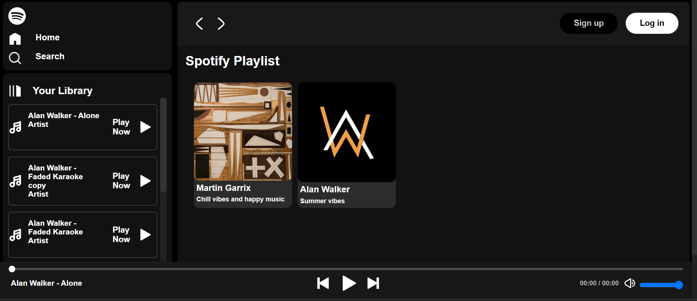
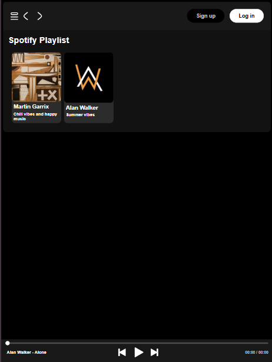
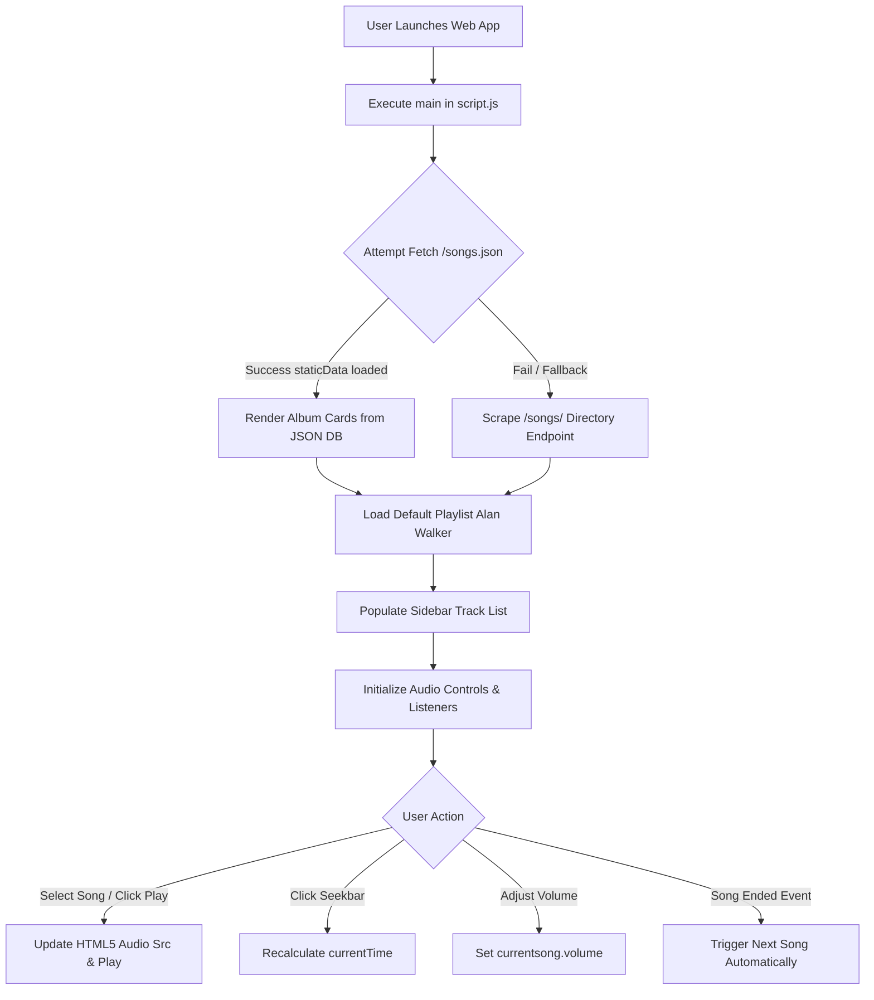

<div align="center">

  

  # 🎵 Spotify Web Player Clone

  **A pixel-perfect, framework-free Spotify Web Player built with Vanilla HTML5, CSS3, and JavaScript (ES6+).**

  [](https://spotifymusic-pla.netlify.app/)
  [](LICENSE)
  [](https://github.com/visheshio/Spotifyclone/pulls)
  [](https://developer.mozilla.org/en-US/docs/Web/HTML)
  [](https://developer.mozilla.org/en-US/docs/Web/CSS)
  [](https://developer.mozilla.org/en-US/docs/Web/JavaScript)

  [**Explore Live Demo »**](https://spotifymusic-pla.netlify.app/) · [Report Bug](https://github.com/visheshio/Spotifyclone/issues) · [Request Feature](https://github.com/visheshio/Spotifyclone/issues)

</div>

---

## 📌 Table of Contents

- [Overview](#-overview)
- [Screenshots & Visuals](#-screenshots--visuals)
- [Key Features](#-key-features)
- [Architecture & Data Flow](#-architecture--data-flow)
- [Tech Stack](#-tech-stack)
- [Project Structure](#-project-structure)
- [Getting Started](#-getting-started)
  - [Prerequisites](#prerequisites)
  - [Installation](#installation)
  - [Running Locally](#running-locally)
- [Adding Albums & Music](#-adding-albums--music)
- [Deployment](#-deployment)
  - [Deploy to Vercel](#deploy-to-vercel)
  - [Deploy to Netlify](#deploy-to-netlify)
  - [Deploy to GitHub Pages](#deploy-to-github-pages)
- [Browser Support](#-browser-support)
- [Performance & Optimization](#-performance--optimization)
- [Contributing](#-contributing)
- [License](#-license)
- [Acknowledgments](#-acknowledgments)

---

## 📖 Overview

The **Spotify Web Player Clone** is a lightweight, high-performance web audio player designed to recreate the intuitive user interface and experience of Spotify's Web Player.

Built entirely **without external libraries, build tools, or frontend frameworks**, this project demonstrates how clean Vanilla HTML, modern CSS (Flexbox, CSS Variables, Media Queries), and native Web APIs (HTML5 Audio, DOM Manipulation, Fetch API) can deliver a seamless, responsive streaming experience.

---

## 📸 Screenshots & Visuals

<div align="center">

| **Desktop Web Player UI** | **Mobile Navigation Drawer** |
| :---: | :---: |
|  |  |

</div>

---

## ✨ Key Features

- **🎧 Hybrid Track Loading System**:
  - Automatically loads playlist metadata dynamically using `songs.json` static catalog for fast serverless hosting (Vercel, Netlify, GitHub Pages).
  - Falls back to server directory endpoint scraping (`/songs/`) when running on local HTTP servers.
- **🎛️ Dynamic Audio Player**:
  - Full playback controls: **Play**, **Pause**, **Next Track**, **Previous Track**, and **Auto-Play Next** upon track completion.
  - Interactive seekbar with smooth visual drag indicator and instant jump-to-time functionality.
  - Real-time timestamp tracking formatted in standard `MM:SS` duration display.
- **🔊 Real-Time Volume Slider**: Smooth amplitude adjustment using native HTML range inputs synchronized with the Audio API.
- **📱 Fully Responsive Layout**:
  - Desktop: Dual-pane layout featuring fixed navigation sidebar, library drawer, main album content grid, and persistent bottom playbar.
  - Mobile: Collapsible slide-out drawer triggered by hamburger toggle for seamless mobile streaming.
- **🎨 Dark Mode UI/UX**: Matches Spotify's signature visual aesthetic—custom dark palettes, rounded cards, sleek green play action buttons, and custom webkit scrollbars.
- **⚡ Zero External Dependencies**: 0% external JS frameworks, 100% native web speed.

---

## 🏗️ Architecture & Data Flow

### Hybrid Loading & Audio Engine Flow


```mermaid
flowchart TD
    A[User Launches Web App] --> B[Execute main in script.js]
    B --> C{Attempt Fetch /songs.json}

    C -- Success staticData loaded --> D[Render Album Cards from JSON DB]
    C -- Fail / Fallback --> E[Scrape /songs/ Directory Endpoint]

    D --> F[Load Default Playlist Alan Walker]
    E --> F
    
    F --> G[Populate Sidebar Track List]
    G --> H[Initialize Audio Controls & Listeners]
    
    H --> I{User Action}
    I -- Select Song / Click Play --> J[Update HTML5 Audio Src & Play]
    I -- Click Seekbar --> K[Recalculate currentTime]
    I -- Adjust Volume --> L[Set currentsong.volume]
    I -- Song Ended Event --> M[Trigger Next Song Automatically]
```

---

## 🛠️ Tech Stack

| Domain | Technology / Specification | Purpose |
| :--- | :--- | :--- |
| **Markup** | HTML5 Semantic Tags | Structured grid, accessible media controls, modal structure |
| **Styling** | CSS3 (Variables, Flexbox, Media Queries) | Responsive dark theme, animations, scrollbars |
| **Logic Engine** | Vanilla JavaScript (ES6+) | Event handling, state management, asynchronous fetch |
| **Audio Engine** | HTML5 `Audio` Web API | Native track playback, duration, currentTime management |
| **Hosting Config** | Vercel JSON & Netlify TOML | Static edge routing, CORS configuration |

---

## 📁 Project Structure

```text
Spotifyclone/
├── 📄 index.html          # Main application structure (Sidebar, Grid, Playbar)
├── 🎨 style.css           # Primary application styling, theme variables, responsiveness
├── 🛠️ utility.css         # Utility classes, flex helpers, custom scrollbars
├── 📜 script.js          # Core audio engine, state management, UI controller
├── 📊 songs.json          # Static music & album metadata catalog
├── ⚙️ vercel.json         # Vercel deployment & routing config
├── ⚙️ netlify.toml        # Netlify CORS & build header settings
├── 🖼️ desktopspotify.png  # Desktop UI preview screenshot
├── 🖼️ mobileview.png      # Mobile UI preview screenshot
├── 🖼️ img/                # UI icons & album cover assets
│   ├── logo.svg           # Spotify brand logo
│   ├── play.svg           # Album hover play icon
│   ├── playsong.svg       # Playbar play icon
│   ├── pause.svg          # Playbar pause icon
│   ├── previous.svg       # Previous track icon
│   ├── nextsong.svg       # Next track icon
│   ├── volume.svg         # Volume control icon
│   ├── hamburger.svg      # Mobile drawer menu toggle
│   ├── close.svg          # Mobile drawer close icon
│   ├── alanw.webp         # Alan Walker cover art
│   └── marting.webp       # Martin Garrix cover art
└── 🎵 songs/              # Album directories containing MP3 audio files
    ├── Alanwalker/        # Alan Walker tracks (.mp3)
    └── martingarrix/      # Martin Garrix tracks (.mp3)
```

---

## 🚀 Getting Started

### Prerequisites

All you need is a modern web browser:
- Google Chrome, Mozilla Firefox, Microsoft Edge, Safari, or Brave.

### Installation

1. **Clone the Repository**:
   ```bash
   git clone https://github.com/visheshio/Spotifyclone.git
   ```

2. **Navigate to the Directory**:
   ```bash
   cd Spotifyclone
   ```

### Running Locally

Because the audio player loads local audio assets and JSON databases, run the application using a local web server:

#### Option 1: Python HTTP Server (Built-in)
```bash
python3 -m http.server 3000
```
Open `http://localhost:3000` in your browser.

#### Option 2: VS Code Live Server Extension
1. Install **Live Server** extension in VS Code.
2. Right-click `index.html` and select **"Open with Live Server"**.

#### Option 3: Node.js `http-server` / `npx`
```bash
npx http-server . -p 3000
```
Open `http://localhost:3000` in your browser.

#### Option 4: Bun
```bash
bun x http-server . -p 3000
```

---

## 🎵 Adding Albums & Music

You can add new music in two ways:

### Method A: Static Database (Recommended for Web Deployment)

1. Place your `.mp3` audio files inside `songs/<folder_name>/`.
2. Add an entry to `songs.json` in the root directory:
   ```json
   {
     "folder": "artistname",
     "title": "Artist / Album Title",
     "description": "Album Description",
     "coverSrc": "/img/cover.webp",
     "songs": [
       "Song_1.mp3",
       "Song_2.mp3"
     ]
   }
   ```

### Method B: Directory Endpoint (For Local HTTP Servers)

1. Create a subfolder inside `songs/` (e.g., `songs/EdSheeran/`).
2. Add `.mp3` audio files into `songs/EdSheeran/`.
3. (Optional) Add `info.json` inside the album folder for metadata.

---

## 🌐 Deployment

### Deploy to Vercel
```bash
npx vercel
```
The included `vercel.json` ensures static files and audio formats are served seamlessly.

### Deploy to Netlify
1. Connect your repository to Netlify.
2. Set publish directory to `./`.
3. Netlify will apply `netlify.toml` automatically.

### Deploy to GitHub Pages
1. Go to repository **Settings** -> **Pages**.
2. Select `main` branch as the source and click **Save**.

---

## 🌐 Browser Support

| Browser | Supported Version |
| :--- | :--- |
| **Google Chrome** | ✅ 60+ |
| **Mozilla Firefox** | ✅ 55+ |
| **Microsoft Edge** | ✅ 79+ |
| **Apple Safari** | ✅ 11+ |
| **Brave / Opera** | ✅ Fully Supported |

---

## ⚡ Performance & Optimization

- **Zero Bundle Size**: No build step or node module dependencies required to run.
- **Fast Load Times**: SVG vector icons and WebP optimized image covers reduce initial payload.
- **Asynchronous Audio Stream**: Audio files are buffered on demand through native browser stream pipelines.

---

## 🤝 Contributing

Contributions make the open-source community an incredible place to learn, inspire, and create. Any contributions you make are **greatly appreciated**.

1. Fork the Project (`https://github.com/visheshio/Spotifyclone/fork`)
2. Create your Feature Branch (`git checkout -b feature/AmazingFeature`)
3. Commit your Changes (`git commit -m 'Add some AmazingFeature'`)
4. Push to the Branch (`git push origin feature/AmazingFeature`)
5. Open a Pull Request

---

## 📄 License

Distributed under the **MIT License**. See `LICENSE` for details.

---

## 🙏 Acknowledgments

- [Spotify](https://spotify.com) for design inspiration and iconic user interface concepts.
- Alan Walker & Martin Garrix audio tracks used strictly for educational and demonstration purposes.

---

<div align="center">
  <sub>Built with ❤️ by Vishesh & Contributors</sub>
</div>
